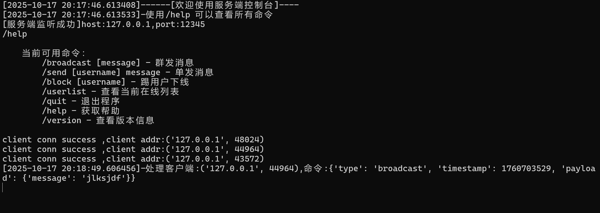
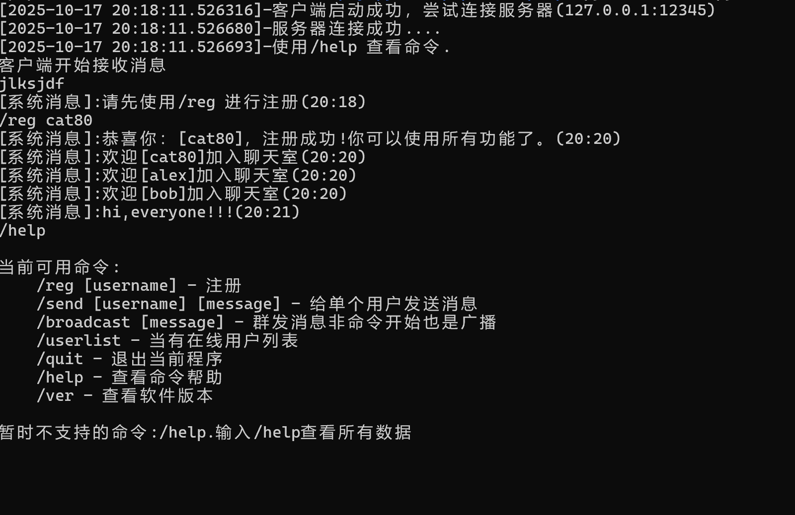
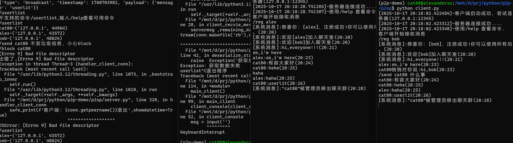

# P2SP (Peer-to-Server-Peer) Network Programming Practice Project

## Project Overview

P2SP (Peer-to-Server-Peer) is a practical project built to gain in-depth understanding of the underlying principles of network programming. Based on the TCP protocol, this project uses a **blocking I/O and multi-threading** concurrency model, and communicates between client and server through a **custom binary protocol**. All interactions between clients are forwarded through the server acting as a central node.

This project is not just a simple chat room program, but rather an "experimental platform" for researching and comparing different network models. By implementing this classic model firsthand, one can deeply appreciate its advantages and challenges in terms of performance, resource consumption, and state management. This provides a solid practical foundation and reference for subsequent exploration and mastery of high-performance asynchronous I/O models such as `epoll` and `asyncio`.

## Project Objectives

1.  **Master Core Network Programming**: Gain deep understanding of TCP Socket programming, stream data transmission, and the underlying implementation details of Client-Server (C/S) architecture.
2.  **Explore Concurrency Models**: Practice and analyze the operation mechanism, application scenarios, and inherent performance bottlenecks (such as the C10K problem) of the classic "Blocking I/O + Multi-threading" (Thread-per-Connection) concurrency model.
3.  **Lay Foundation for P2P Networks**: Although named P2SP, by implementing a centralized message forwarding hub, it can accumulate key technical knowledge about node discovery, message broadcasting, and state synchronization for building more complex decentralized P2P networks (such as blockchain networks) in the future.

## Technical Highlights and Implementation Details

While the project code is concise, it includes core technical points in network programming, making it an excellent starting point for network development.

### 1. Custom Binary Communication Protocol (`protocol.py`)

To efficiently and reliably transmit data, the project designs and implements a custom binary protocol instead of simply using plain text or JSON strings.

-   **Protocol Structure**: `Magic Number (4 bytes) + Checksum (4 bytes, not implemented yet) + Payload Length (4 bytes) + Payload (JSON)`
-   **Fixed Header**: Uses a fixed-length header containing a `MAGIC_HEADER` (magic number `\xab\xcd\xef\x88`) for quick message boundary detection, and a `payload_len` field indicating the exact length of the message body.
-   **Data Encapsulation**: Uses Python's `struct` module to pack and unpack the header, achieving efficient conversion between structured binary data and Python data types.
-   **Flexible Payload**: The message body (Payload) uses JSON format, combining the efficiency of binary protocols with the readability and extensibility of JSON, making it easy to add new message types and fields in the future.

### 2. Solution to TCP Packet Sticking Problem (`protocol.py: deserialize_stream`)

TCP is a stream-based protocol without message boundaries, where multiple packets may be merged (sticking) or split. The project's `deserialize_stream` function provides a robust solution:

-   **Loop and Buffer**: The function continuously reads data from the socket's IO stream in a `while` loop and maintains a `buffer`.
-   **Boundary Detection**: Locates the start of a potential message by searching for `MAGIC_HEADER` in the `buffer`.
-   **Precise Reading**: Once the header is found and `payload_len` is parsed, the function precisely reads `payload_len` bytes of data from the buffer as the message body, no more and no less.
-   **Remaining Data Handling**: After reading a complete message, the remaining data in the buffer (`remaining_data`) is preserved for the next parsing.

This process perfectly solves the message boundary problem in TCP stream transmission, ensuring that the application layer receives independent, complete messages.

### 3. Classic "One Connection, One Thread" Concurrency Model (`server.py`)

The server uses the classic "Thread-per-Connection" model to handle concurrency.

-   **Blocking Accept**: The main thread waits for new connections using `server_socket.accept()`.
-   **Thread Creation**: Whenever a new client connection is successful, the server creates a new thread (`threading.Thread`) specifically responsible for handling all subsequent requests from that client.
-   **Advantages and Challenges**: The advantage of this model is its simple logic and good isolation, with each thread only needing to care about its own client. However, its disadvantages are also obvious: when the number of connections reaches hundreds or thousands, the massive thread creation, destruction, and context switching will consume enormous system resources, leading to limited server scalability. This is exactly the core pain point that asynchronous models like `asyncio` aim to solve.

### 4. Thread-Safe State Management (`server.py`)

In a multi-threaded environment, all threads share the server's memory space (such as the online user list). To avoid data races and state inconsistency, the project introduces thread locks.

-   **Shared Resources**: `current_online_user_dict` and `peername_username_dict` are global dictionaries shared by multiple client threads.
-   **Mutual Exclusion Access**: Uses `threading.Lock` (`client_lock`) to protect all operations involving modification of these shared dictionaries. At any time, only one thread can enter the `with client_lock:` code block, ensuring atomicity of operations and data consistency. This is one of the most fundamental and important concepts in multi-threaded programming.

## Features

### Server Features
-   **User Management**: View current online user list (`/userlist`), force users offline (`/block <username>`).
-   **Message Broadcasting**: Broadcast messages to all online users as system (`/broadcast <message>`).
-   **Private Messages**: Send private messages to specified users as system (`/send <username> <message>`).
-   **Command Line Interaction**: Provides a separate thread running a server console for real-time administration.

### Client Features
-   **User Registration**: Must register a unique username using `/reg <username>` after connecting.
-   **Message Broadcasting**: Broadcast messages to all chat room members (`/broadcast <message>` or directly input message).
-   **Private Messages**: Send private messages to specified users (`/send <username> <message>`).
-   **Information Query**: View current online user list (`/userlist`).

## Project Structure
```
p2sp/
├── protocol.py         # Core: Custom binary protocol and TCP stream processing
├── server.py           # Server: Multi-threading concurrency model and business logic
├── client.py           # Client: Multi-threading IO processing and user interaction
├── tests/              # Unit test directory
│   └── test_protocol.py # Unit tests for protocol.py 
```

## Running the Project

### Starting the Server
```bash
python server.py
```


### Starting the Client
Run the client program in multiple new terminal windows:
```bash
python client.py
```
After the client connects, it needs to register before using other functions:


After successful registration, all functions can be experienced:


## Available Commands

### Client Commands
| Command | Description | Example |
|---------|-------------|---------|
| `/reg <username>` | Register username | `/reg alice` |
| `/send <username> <message>` | Send private message to user | `/send bob hello` |
| `/broadcast <message>` | Broadcast message to all | `/broadcast hello everyone` |
| `/userlist` | View online user list | `/userlist` |
| `/help` | View command help | `/help` |
| `/ver` | View software version | `/ver` |

## Project Iteration and Optimization Directions

As a starting point for learning and research, this project can be deepened in the following directions to evolve toward a production-level application:

-   **Architecture Optimization**:
    -   **Module Decoupling**: Further separate connection management, message distribution, and user state modules to form a clearer hierarchical structure.
    -   **Asynchronous Refactoring**: Based on this project's experience, refactor the server using `asyncio` and `aiohttp` libraries to visually compare their performance and resource utilization differences with the multi-threading model.
-   **Protocol Optimization**:
    -   **Request/Response Separation**: Refer to the HTTP protocol to clearly distinguish between client request and server response message types, making the protocol more structured.
    -   **Error Handling**: Add unified error codes and error message fields to facilitate client handling of exceptional situations.
-   **Engineering Improvements**:
    -   **Configuration Management**: Move hard-coded configuration items like HOST and PORT to configuration files or environment variables.
    -   **Logging System**: Introduce the `logging` module to replace `print`, implementing structured, hierarchical log recording.
    -   **Robustness**: Add more comprehensive input validation and exception handling, such as handling `BrokenPipeError` when clients suddenly disconnect.
-   **Feature Enhancement**:
    -   **Data Persistence**: Introduce databases (such as SQLite, PostgreSQL) to store user information and implement persistent registered users.
    -   **Offline Messages**: Add offline message storage functionality for users.
    -   **Reconnection**: Implement automatic client reconnection mechanism.