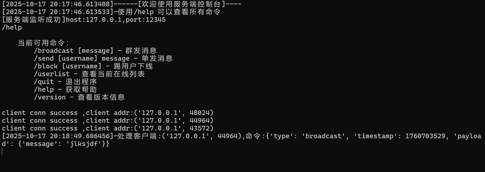
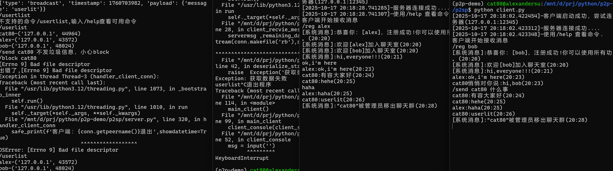

# P2SP (Peer-to-Server-Peer) 网络编程实践项目

## 项目概述

P2SP (Peer-to-Server-Peer) 是一个为了深入学习网络编程底层原理而构建的实践项目。本项目基于TCP协议，采用**阻塞式IO与多线程**的并发模型，并通过**自定义二进制协议**在客户端与服务端之间进行通信。客户端之间的所有交互均通过服务端作为中心节点进行代理转发。

这个项目不仅仅是一个简单的聊天室程序，它更是一个研究和对比不同网络模型的“实验平台”。通过亲手实现这个经典模型，可以深刻体会到其在性能、资源消耗和状态管理上的优势与挑战，这为后续探索和掌握 `epoll`、`asyncio` 等高性能异步IO模型提供了坚实的实践基础和参照。

## 项目目标

1.  **掌握网络编程核心**：深入理解TCP Socket编程、流式数据传输、以及客户端-服务器（C/S）架构的底层实现细节。
2.  **探索并发模型**：实践并分析“阻塞IO + 多线程”（Thread-per-Connection）这一经典并发模型的运作机制、适用场景及其固有的性能瓶颈（如C10K问题）。
3.  **奠定P2P网络基础**：虽然名为P2SP，但通过实现一个中心化的消息转发枢纽，可以为后续构建更复杂的去中心化P2P网络（如区块链网络）积累关于节点发现、消息广播、状态同步等关键技术的认知。
4.  **打造求职亮眼作品**：作为一个具备完整功能、清晰架构和详尽文档的项目，它可以向面试官展示你扎实的网络编程功底、严谨的工程思维以及对技术深度探索的热情。

## 技术亮点与实现细节

本项目虽然代码简洁，但在关键环节包含了网络编程中的核心技术点，非常适合在求职面试中进行深入探讨。

### 1. 自定义二进制通信协议 (`protocol.py`)

为了高效、可靠地进行数据传输，项目设计并实现了一套自定义的二进制协议，而非简单的使用纯文本或JSON字符串。

-   **协议结构**: `魔数(4字节) + 校验和(4字节, 暂未实现) + Payload长度(4字节) + Payload(JSON)`
-   **固定头部**: 使用定长的头部，其中包含一个`MAGIC_HEADER`（魔数 `\xab\xcd\xef\x88`）用于快速定位消息边界，以及一个`payload_len`字段指明了消息体的确切长度。
-   **数据封装**: 利用Python的`struct`模块对头部进行打包(pack)和解包(unpack)，实现了结构化二进制数据与Python数据类型之间的高效转换。
-   **灵活Payload**: 消息体(Payload)采用JSON格式，兼具了二进制协议的高效性和JSON的易读性与扩展性，方便未来增加新的消息类型和字段。

### 2. TCP粘包问题的解决方案 (`protocol.py: deserialize_stream`)

这是本项目中最具技术含量的部分。TCP是基于流的协议，本身没有消息边界的概念，多个数据包可能被合并（粘包）或拆分。本项目的`deserialize_stream`函数提供了一个健壮的解决方案：

-   **循环与缓冲**: 函数在一个`while`循环中持续从socket的IO流中读取数据，并维护一个`buffer`。
-   **消息边界查找**: 通过在`buffer`中搜索`MAGIC_HEADER`来定位一个潜在消息的开始。
-   **精确读取**: 一旦找到头部并解析出`payload_len`，函数会精确地从缓冲区读取`payload_len`长度的数据作为消息体，不多也不少。
-   **剩余数据处理**: 读取一个完整的消息后，缓冲区中余下的数据 (`remaining_data`) 会被保留，用于下一次解析。

这个过程完美地解决了TCP流式传输中的消息边界问题，确保了应用层能够接收到一个个独立、完整的消息。能够清晰地阐述这一点，可以充分证明你对TCP协议有深刻的理解。

### 3. “一个连接一个线程”的经典并发模型 (`server.py`)

服务端采用了经典的“Thread-per-Connection”模型来处理并发。

-   **阻塞式Accept**: 主线程通过`server_socket.accept()`阻塞式地等待新连接。
-   **线程创建**: 每当有新的客户端连接成功，服务器就会创建一个新的线程 (`threading.Thread`)，专门负责处理该客户端的所有后续请求。
-   **优点与挑战**: 这种模型的优点是逻辑简单、隔离性好，每个线程只需关心自己的客户端。但其缺点也十分明显：当连接数成百上千时，大量的线程创建、销毁和上下文切换会消耗巨大的系统资源，导致服务器扩展性受限。这正是`asyncio`等异步模型要解决的核心痛点。

### 4. 线程安全的状态管理 (`server.py`)

在多线程环境下，所有线程共享服务端的内存空间（如在线用户列表）。为了避免数据竞争和状态不一致，项目引入了线程锁。

-   **共享资源**: `current_online_user_dict` 和 `peername_username_dict` 是被多个客户端线程共享的全局字典。
-   **互斥访问**: 使用`threading.Lock` (`client_lock`) 对所有涉及修改这些共享字典的操作进行加锁保护。任何时候只有一个线程能进入`with client_lock:`代码块，从而保证了操作的原子性和数据的一致性。这是多线程编程中最基础也是最重要的概念之一。

## 功能特性

### 服务端功能
-   **用户管理**: 查看当前在线用户列表 (`/userlist`)、强制用户下线 (`/block <username>`)。
-   **消息广播**: 以系统身份向所有在线用户广播消息 (`/broadcast <message>`)。
-   **私聊消息**: 以系统身份向指定用户发送私聊消息 (`/send <username> <message>`)。
-   **命令行交互**: 提供了一个独立的线程运行服务端控制台，方便管理员进行实时管理。

### 客户端功能
-   **用户注册**: 连接后必须使用 `/reg <username>` 注册一个唯一的用户名。
-   **消息广播**: 向聊天室所有成员广播消息 (`/broadcast <message>` 或直接输入消息)。
-   **私聊消息**: 向指定用户发送私密消息 (`/send <username> <message>`)。
-   **信息查询**: 查看当前在线用户列表 (`/userlist`)。

## 项目结构
```
p2sp/
├── protocol.py         # 核心：自定义二进制协议与TCP流处理
├── server.py           # 服务端：多线程并发模型与业务逻辑
├── client.py           # 客户端：多线程IO处理与用户交互
├── tests/              # 单元测试目录
│   └── test_protocol.py # 针对protocol.py的单元测试
└── md-img/             # 项目截图目录
```

## 项目运行

### 启动服务端
```bash
python server.py
```


### 启动客户端
在多个新的终端窗口中分别运行客户端程序：
```bash
python client.py
```
客户端连接后，需要先注册才能使用其他功能：


注册成功后，即可体验所有功能：


## 可用命令

### 客户端命令
| 命令 | 说明 | 示例 |
|------|------|------|
| `/reg <username>` | 注册用户名 | `/reg alice` |
| `/send <username> <message>` | 私发消息给用户 | `/send bob 你好` |
| `/broadcast <message>` | 广播群发消息 | `/broadcast 大家好` |
| `/userlist` | 查看在线用户列表 | `/userlist` |
| `/help` | 查看命令帮助 | `/help` |
| `/ver` | 查看软件版本 | `/ver` |

## 项目迭代与优化方向

本项目作为一个学习和研究的起点，若要向生产级应用演进，可在以下方向进行深化：

-   **架构优化**:
    -   **模块解耦**: 将连接管理、消息分发、用户状态等模块进一步分离，形成更清晰的层次结构。
    -   **异步化改造**: 基于本项目的经验，使用`asyncio`和`aiohttp`等库重构服务端，直观对比其与多线程模型在性能和资源利用率上的巨大差异。
-   **协议优化**:
    -   **请求/响应分离**: 参考HTTP协议，明确区分客户端请求和服务端响应的消息类型，使协议更有结构性。
    -   **错误处理**: 增加统一的错误码和错误消息字段，方便客户端处理异常情况。
-   **工程化改进**:
    -   **配置管理**: 将HOST、PORT等硬编码的配置项移至配置文件或环境变量中。
    -   **日志系统**: 引入`logging`模块，替代`print`，实现结构化、分级别的日志记录。
    -   **健壮性**: 增加更完善的输入验证和异常处理，如处理客户端突然断开连接的`BrokenPipeError`等。
-   **功能增强**:
    -   **数据持久化**: 引入数据库（如SQLite、PostgreSQL）存储用户信息，实现注册用户的持久化。
    -   **离线消息**: 为用户增加离线消息存储功能。
    -   **断线重连**: 实现客户端的自动断线重连机制。